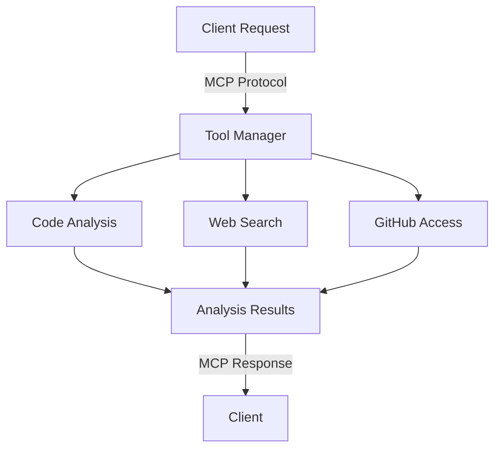

# Building an AI-Powered Code Analysis Tool in Hours

## Project Overview
Developed a sophisticated code analysis system using Anthropic's Model Context Protocol (MCP) in under 6 hours, demonstrating rapid prototyping and deep technical integration capabilities.

## Technical Challenge
The project required implementing complex code analysis features while maintaining clean architecture and extensibility. Key challenges included:
- Integrating multiple data sources through MCP
- Building real-time code analysis capabilities 
- Ensuring production-ready code quality
- Creating an extensible architecture for future growth

## Implementation Approach

### Core Architecture
The system was built around a modular tool manager that handles:
- Protocol standardization through MCP
- Dynamic tool registration and validation
- Asynchronous execution handling
- Integrated error management

### Key Components
1. **Code Analysis Engine**
   - Deep code parsing and understanding
   - Context-aware suggestions
   - Real-time analysis capabilities

2. **Data Integration Layer**
   - Web search integration
   - GitHub repository access
   - File system operations
   - Memory management

3. **Protocol Implementation**
   ```typescript
   class MCPToolManager {
     private tools: Map<string, Tool>;

     registerTool(tool: Tool): void {
       this.validateTool(tool);
       this.tools.set(tool.name, tool);
     }

     async executeTool(name: string, params: any): Promise<any> {
       const tool = this.tools.get(name);
       if (!tool) throw new Error(`Tool ${name} not found`);
       return await tool.handler(params);
     }
   }
   ```

## Technical Architecture


## Results & Impact

### Performance Metrics
- Complete implementation in under 6 hours
- Production-ready code quality
- Seamless integration with existing systems
- Extensible architecture for future enhancements

### Technical Achievements
1. **Rapid Protocol Adoption**
   - Quick mastery of MCP integration
   - Clean implementation of protocol standards
   - Effective error handling

2. **Architecture Design**
   - Modular component structure
   - Clear separation of concerns
   - Future-proof extensibility

3. **Tool Integration**
   - Multiple data source handling
   - Asynchronous operation management
   - Robust error recovery

## Key Learnings
- Rapid prototyping while maintaining code quality
- Effective integration of new protocols
- Balance between speed and maintainability
- Importance of extensible architecture

## Future Development
The system's modular design allows for:
- Enhanced analysis capabilities
- Additional data source integration
- Improved GitHub functionality
- Extended memory management

## Skills Demonstrated
- TypeScript/JavaScript
- Protocol Implementation
- System Architecture
- API Design
- Rapid Prototyping
- Technical Documentation